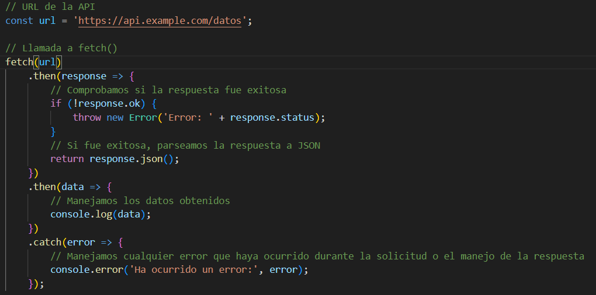
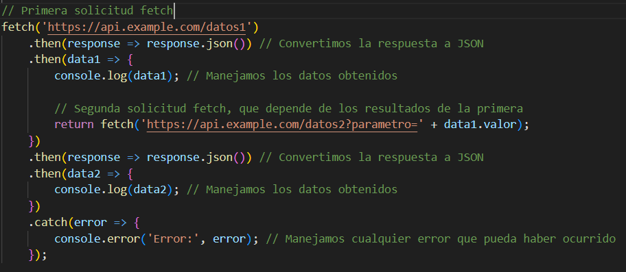

# Índice

1. Introducción
2. ¿Qué es Fetch?
3. ¿Qué es la carga asíncrona con Fetch?
4. Elementos necesarios para desarrollar un mantenimiento completo (CRUD) de la BBDD

## Introducción

En este documento, explicaré qué es fetch y los elementos necesarios para desarrollar un mantenimiento completo de la base de datos utilizando la tecnología de Carga asíncrona con Fetch.

## ¿Qué es Fetch?

En JavaScript, `fetch()` es una función incorporada que se utiliza para realizar solicitudes de red y obtener recursos de manera asíncrona a través de la red, como datos JSON, imágenes, archivos o HTML. Esta función permite realizar solicitudes HTTP a servidores y recuperar respuestas para su posterior manipulación.

## ¿Qué es la carga asíncrona con Fetch?

La carga asíncrona con `fetch()` en JavaScript se refiere a la capacidad de realizar solicitudes de red y obtener recursos sin bloquear la ejecución del resto del código. Esto significa que puedes solicitar datos y seguir ejecutando otras tareas mientras esperas la respuesta. Fetch es una API moderna y flexible proporcionada por los navegadores web para realizar solicitudes HTTP y manipular respuestas.

Aqui tenemos un ejemplo de un `fetch()` sencillo:

## Elementos necesarios para desarrollar un mantenimiento completo (CRUD) de la BBDD

- **Servidor Backend:** Un servidor backend que proporcione una API RESTful para realizar operaciones CRUD (Crear, Leer, Actualizar, Eliminar) en la base de datos.
- **Conexión a la BBDD:** Necesitarás una forma de conectarte a la base de datos. Esto podría ser a través de un servidor de base de datos o una API que te permita interactuar con la base de datos.
- **Cliente Frontend (Request):** Una interfaz de usuario que permita a los usuarios interactuar con la aplicación. 
- **Respuesta:** Los datos que obtienes del servidor después de una solicitud exitosa o fallida.
- **Encabezados:** Metadatos adicionales que se mandan a la API para ayudar al servidor a comprender qué tipo de solicitud se está mandando, por ejemplo, “content-type” (tipo de contenido).
- **Manejo de errores:** Deberás tener en cuenta cómo manejarás los errores que puedan surgir durante las solicitudes de fetch().
- **Promesas y asincronía:** Dado que fetch() trabaja con promesas, necesitarás entender cómo trabajar con ellas para manejar las respuestas de las solicitudes de manera asíncrona.

### Que son las promesas?

Las promesas en JavaScript son como contratos para el futuro. Cuando realizas una tarea que lleva tiempo, como cargar una imagen o solicitar datos a un servidor, JavaScript crea una “promesa” que representa la finalización futura de esa tarea.

Elementos de una promesa:
1. **Creacion de la promesa:** Cuando inicias una tarea asíncrona, creas una promesa. Esta promesa es un objeto que representa la tarea en curso.
2. **Espera:** Mientras la tarea está en progreso, la promesa está en un estado “pendiente”. Tu código puede continuar ejecutándose mientras espera que la promesa se resuelva.
3.  **Resolución:** Cuando la tarea se completa, la promesa se “resuelve” con un valor (si la tarea fue exitosa) o se “rechaza” con un error (si algo salió mal).
4. **Manejo de la resolución:** Puedes configurar funciones de devolución de llamada (callbacks) para manejar el valor de resolución o el error utilizando los métodos .then() (para el éxito) y .catch() (para los errores).
5. **Encadenamiento:** Puedes encadenar promesas para realizar varias tareas asíncronas en orden. El valor de resolución de una promesa puede ser utilizado por la siguiente promesa en la cadena.

Aqui tenemos un ejemplo de un `fetch()` con encadenamiento:
