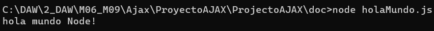

# Node.js + EXPRESS

# Tabla de Contenidos

1. [Introducción Node](#introducción-node)
2. [Utilidades Node](#utilidades-node)
    - [Desarrollo de Servidores Web](#desarrollo-de-servidores-web)
    - [Aplicaciones en Tiempo Real](#aplicaciones-en-tiempo-real)
    - [Desarrollo de APIs](#desarrollo-de-apis)
    - [Automatización de Tareas](#automatización-de-tareas)
    - [Aplicaciones de Microservicios](#aplicaciones-de-microservicios)
3. [Introducción Express](#introducción-express)
4. [Utilidades Express](#utilidades-express)
    - [Simplicidad](#simplicidad)
    - [Flexibilidad](#flexibilidad)
    - [Middleware](#middleware)
    - [Enrutamiento](#enrutamiento)
5. [Instalación EXPRESS](#instalación-express)
5. [Ejemplos](#ejemplos)
    - [Hola mundo node](#hola-mundo-node)
    - [Empezar proyecto en Express](#empezar-proyecto-en-express)
    - [Metodo listen](#metodo-listen)
    - [Creacion de rutas](#creacion-de-rutas)
6. [Ejercicio](#ejercicio)

## Introducción Node

Node.js se diferencia de otros entornos de ejecución de JavaScript, como los navegadores web, ejecuta JavaScript en el servidor. Utiliza el motor V8 de Google Chrome para ejecutar el código JavaScript de manera rápida y eficiente.

Node.js se basa en el modelo de E/S no bloqueante, lo que significa que puede manejar múltiples solicitudes simultáneamente sin bloquear el flujo de ejecución. Esto lo hace especialmente adecuado para aplicaciones que requieren una gran cantidad de E/S, como aplicaciones web en tiempo real, APIs y servidores de archivos.

## Utilidades Node

### Desarrollo de Servidores Web
Node.js es ampliamente utilizado para crear servidores web escalables y de alto rendimiento. Frameworks como Express.js proporcionan una capa adicional de abstracción para facilitar el desarrollo de aplicaciones web.

### Aplicaciones en Tiempo Real
Gracias a su capacidad para manejar conexiones simultáneas de manera eficiente, Node.js es ideal para construir aplicaciones en tiempo real, como salas de chat, juegos en línea y sistemas de notificaciones en tiempo real.

### Desarrollo de APIs
Node.js es una opción popular para construir APIs RESTful debido a su naturaleza liviana y su capacidad para manejar grandes volúmenes de solicitudes de manera eficiente.

### Automatización de Tareas
Node.js se utiliza frecuentemente para automatizar tareas de desarrollo, como la compilación de código, la ejecución de pruebas y la implementación de aplicaciones.

### Aplicaciones de Microservicios
La arquitectura de microservicios se ha vuelto cada vez más popular en el desarrollo de software, y Node.js es una opción común para construir microservicios debido a su escalabilidad y facilidad de uso.

## Introducción Express

Express.js es un framework de aplicación web para Node.js, diseñado para crear aplicaciones web y APIs de manera más rápida y sencilla. Ofrece una capa de abstracción sobre el servidor HTTP de Node.js, simplificando el manejo de rutas, middlewares y solicitudes HTTP.

## Utilidades Express

### Simplicidad:
Express.js es conocido por su sintaxis simple y minimalista, lo que facilita el desarrollo rápido de aplicaciones web.

### Flexibilidad:
Permite crear una amplia gama de aplicaciones web, desde simples sitios estáticos hasta complejas APIs RESTful.

### Middleware: 
Express.js utiliza un sistema de middleware que permite extender las funcionalidades de la aplicación con paquetes de terceros o código personalizado. Esto facilita la implementación de características como el manejo de sesiones, autenticación, compresión de respuestas, entre otros.

### Enrutamiento: 
Permite definir rutas para manejar diferentes tipos de solicitudes HTTP (GET, POST, PUT, DELETE, etc.) y responder a ellas de manera adecuada.

## Instalación EXPRESS
Para la instalacion de EXPREES debemos tener en cuenta que es necesario usar la linea de comandos.
En linea de comandos debemos ubicarnos el el directorio donde va a estar nuestro futuro proyecto, despues debemos ejecutar los siguientes comandos que instalaran los paquetes y las dependencias de EXPRESS en dicho proyecto.

Una vez hecho esto el siguiente paso será crear un archivo tipo JavaScript donde empezar a crear codigo.

## Ejemplos

### Hola mundo Node:
Documento tipo JavaScript.

Se usa la linea de comandos para ejecutar el codigo anterior.

### Empezar proyecto en Express:
Comenzamos con el "require" del propio Express.

Obtenemos como respuesta una variable, que nosotros hemos llamado "app" (convención usada en la mayoría de las veces), mediante la cual podemos configurar la aplicación haciendo uso del API de Express.

### Metodo listen:
El método listen recibe el puerto donde el servidor debe comunicarse con el exterior. El resto de los parámetros son opcionales. En este caso estamos enviando tambien una función callback, que se ejecutará cuando el servidor esté listo, escuchando en el puerto indicado.

### Creacion de rutas:
Como primer parámetro del método get() debemos indicar el patrón de la ruta que queremos recibir. En este caso hemos colocado "/", que equivale a la ruta raíz del servidor. Como segundo parámetro colocamos la función que se ejecutará cuando se reciba una solicitud con tal patrón.

La función encargada de resolver la solicitud recibe dos parámetros que nosotros hemos nombrado "req" y "res" (también por convención). No son más que la "request" de la solicitud HTTP y la "response" que enviaremos al cliente.

## Ejercicio
El ejercico se basará en un pequeño proyecto donde se hará uso de Express para crear y utilizar un servidor al que asignaremos 2 rutas. Posteriormente usaremos el navegador para verlas funcionar.