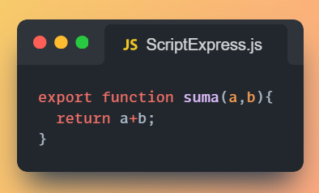
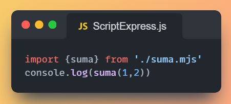
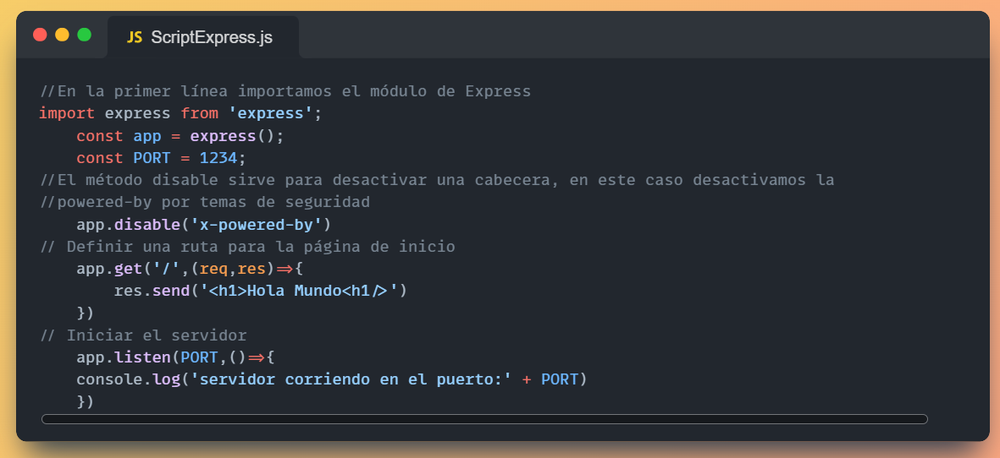
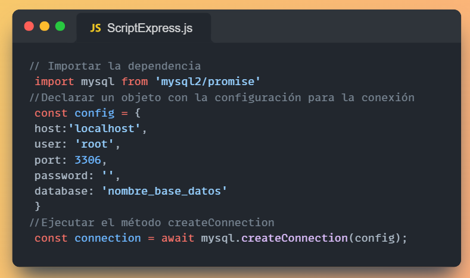
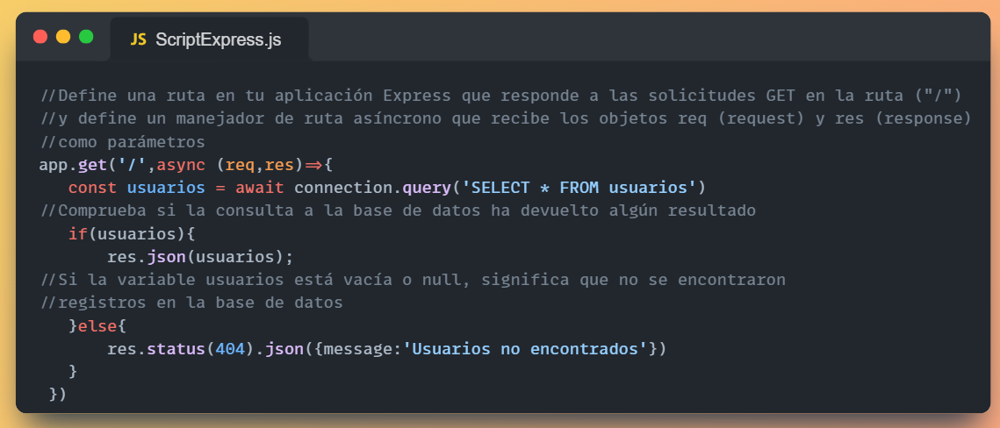
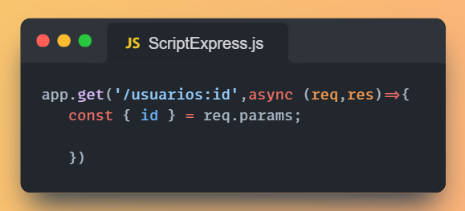
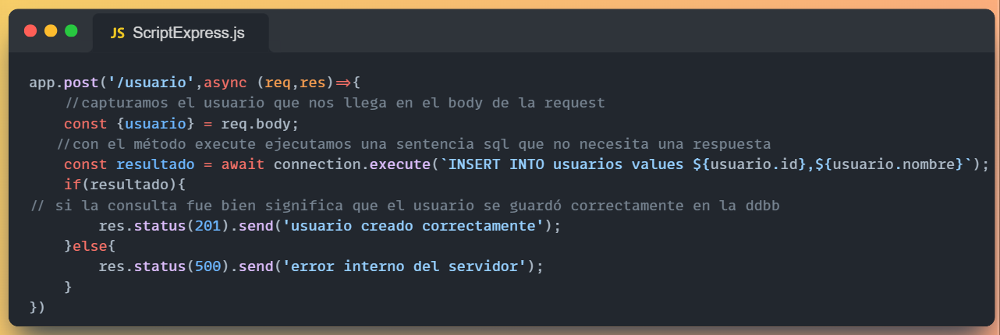
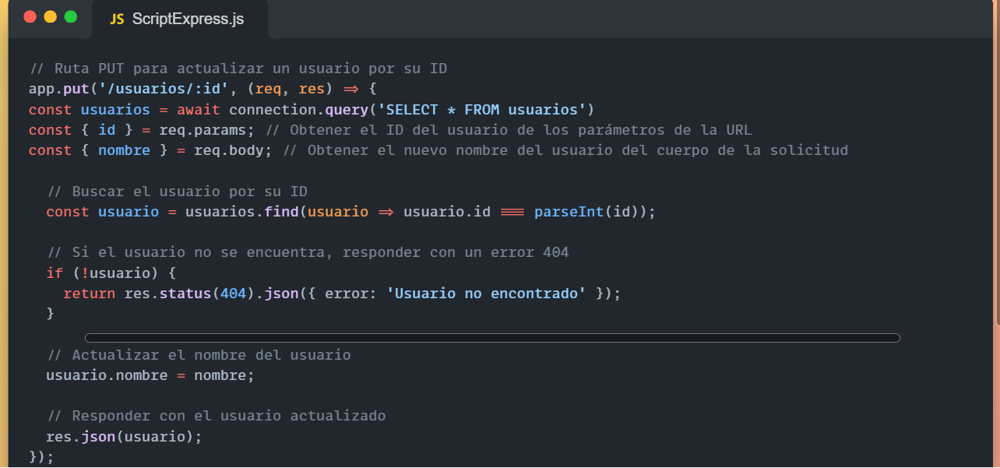
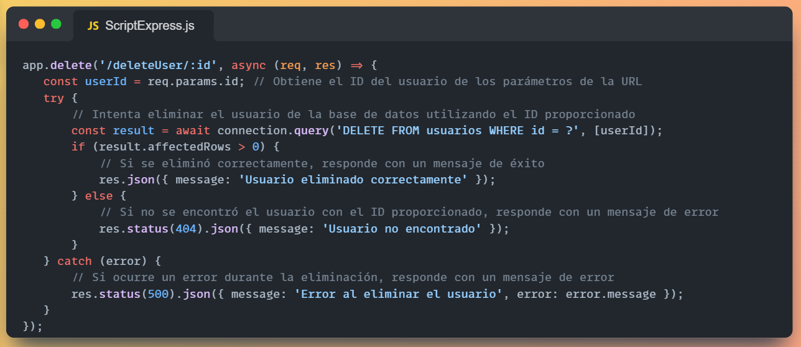

# Node + Express Documentación

## Node js

Node.js tonto harold se diferencia de otros entornos de ejecución de JavaScript, como los navegadores web, ejecuta JavaScript en el servidor. Utiliza el motor V8 de Google Chrome para ejecutar el código JavaScript de manera rápida y eficiente.

Node.js se basa en el modelo de E/S no bloqueante, lo que significa que puede manejar múltiples solicitudes simultáneamente sin bloquear el flujo de ejecución. Esto lo hace especialmente adecuado para aplicaciones que requieren una gran cantidad de E/S, como aplicaciones web en tiempo real, APIs y servidores de archivos.

## Características principales
- El tener el mismo lenguaje en cliente y servidor 
- Permite a cualquier persona desarrollar en backend o en frontend 
- Permite reusar código o incluso mover código de cliente a servidor o al revés 
- Está orientado a eventos y utiliza un modelo asíncrono (propio de JavaScript). 
- Al contrario que en el navegador, encontramos muchas llamadas asíncronas: 
- Llamadas a APIs 
- Lectura y escritura de ficheros 
- Ejecución de cálculos en el servidor
### Llamadas síncronas en servidor serían fatales: 
- ¡Bloqueariamos las conexiones al servidor hasta que acabase la instrucción bloqueante! 
- Al ser asíncrono podremos tener muchas sesiones concurrentes 
- Es monohilo 
- Utiliza un solo procesador 
- Si queremos usar toda la potencia de la CPU, tendremos que levantar varias instancias de node y utilizar un balanceador de carga (por ejemplo con pm2)

## Npm
NPM es el gestor de paquetes de Node.js y es utilizado para instalar y gestionar dependencias de proyectos. NPM ofrece acceso a un repositorio con miles de paquetes de código abierto que pueden ser utilizados en proyectos de Node.js.

## Importación de módulos
Ecma Script (ES) module
Es el sistema de importación y exportación oficial de módulos en node
Para utilizar es modules los archivos deben utilizar la extensión .mjs

Para exportar un módulo se usa la palabra reservada Export,(pueden ser funciones o un objeto)

Para Importar hay que indicar un objeto el cual hay que desestructurar según las funciones que se quieran del módulo super importante poner la extensión del archivo

## Instalación
### Windows
Descarga el instalador de Windows directamente desde el sitio web nodejs.org.
### Ubuntu
En Ubuntu 18.04+ puedes instalar Node usando los siguientes comandos. 
sudo apt update 
sudo apt install nodejs
## Express
Express.js es un conjunto de herramientas que te facilita construir la parte trasera (backend) de tu sitio web. En lugar de empezar desde cero y tener que construir cada parte, Express.js te proporciona todo lo básico que necesitas para hacer un backend sólido

Escritura de manejadores de peticiones con diferentes verbos HTTP en diferentes caminos URL (rutas).
Integración con motores de renderización de "vistas" para generar respuestas mediante la introducción de datos en plantillas.
Establecer ajustes de aplicaciones web como qué puerto usar para conectar, y la localización de las plantillas que se utilizan para renderizar la respuesta.
Añadir procesamiento de peticiones "middleware" adicional en cualquier punto dentro de la tubería de manejo de la petición.

## Instalación
Debemos crear una carpeta donde haremos nuestro proyecto e instalaremos los paquetes, ya que express no es un programa en sí sino como una extensión.

mkdir <nombre de la carpeta>
cd <nombre de la carpeta>

npm install express

## Primeros pasos en Express    

## Conexion DDBB Mysql
Instalar paquetes mysql en el directorio del proyecto: npm install mysql2

## Hacer un GET
El método query nos permite hacer querys en la base de datos, en este caso un select nos devuelve los usuarios que buscamos. Esta query se realiza en el app.get de la ruta que queramos que lo ejecute y la devolvemos con res.json

## Capturar parametros de la url
Para capturar cualquier parámetro, al pasar la url a los métodos de express hay que especificar con : antes por ejemplo /usuarios/:id, y luego con el req.params podemos recuperar el dato con el nombre que le pusimos

   

## Hacer un POST

## Hacer un PUT

## Hacer un DELETE

## Ejecutar el servidor
Para ejecutar el servidor simplemente abrimos una terminal en la carpeta raíz del proyecto y ejecutamos el comando node --watch "nombreDelArchivo.js", de esta manera se reinicia el servidor automáticamente cada vez que detecte algún cambio.

## Propuesta de ejercicio
Con toda la información brindada anteriormente crea un método que accediendo a la ruta /usuarios devuelva un documento html con una card por cada usuario.

