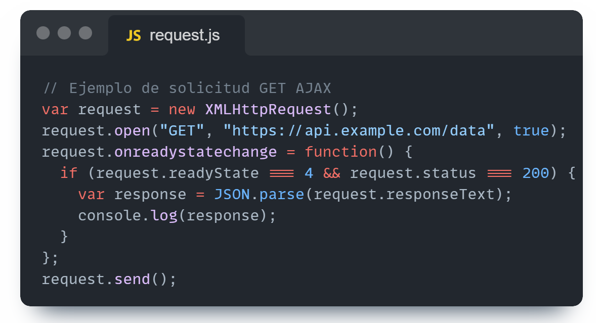

# Javascript AJAX: REST

- [REST](#rest) 

- [Javascript - AJAX](#javascript---ajax) 

- [Cómo hacer una solicitud con AJAX](#cómo-hacer-una-solicitud-con-ajax) 

- [Cómo hacer una solicitud con "fetch"](#cómo-hacer-una-solicitud-con-fetch) 

- [Configurar entorno y BBDD](#configurar-entorno-y-bbdd) 

- [Implementación de CRUD](#implementación-de-crud) 
 
- [Conexión con BBDD](#conexión-con-bbdd) 

- [Propuesta de ejercicio](#propuesta-de-ejercicio) 

## REST  

REST (Representational State Transfer) es un estilo arquitectónico para definir servicios web que sean simples, escalables y eficientes. En el contexto de la web, REST utiliza URIs (Identificadores de Recursos Uniformes) para identificar recursos y el protocolo HTTP para realizar llamadas sobre esos recursos(GET, POST, PUT y DELETE,principalmente). Esto permite una comunicación cliente-servidor donde el cliente puede solicitar y manipular datos al servidor de manera uniforme. 

Por ejemplo, en una API de lista de tareas, podríamos tener los siguientes identificadores, normalmente llamados **endpoints**:

- `/tareas`: Endpoint para obtener todas las tareas o agregar una nueva tarea.
- `/tareas/{id}`: Endpoint para obtener, actualizar o eliminar una tarea específica, donde `{id}` es el identificador único de la tarea.
- `/usuarios`: Endpoint para obtener información sobre usuarios registrados o agregar un nuevo usuario.

Los endpoints son la interfaz principal a través de la cual los clientes interactúan con una API REST, y proporcionan una forma estructurada y uniforme de acceder y manipular recursos en el servidor.

Resumiendo, REST sería la tecnología con la que vamos a dessarrollar las APIs que estén preparadas para recibir las solicitudes que necesitemos.

## Javascript - AJAX 

JavaScript y AJAX (JavaScript asíncrono y XML) están estrechamente relacionados con REST en el desarrollo de aplicaciones web. JavaScript es un lenguaje de programación que se ejecuta en el navegador del cliente, lo que le permite interactuar con los recursos en un servidor a través de solicitudes HTTP.

AJAX no es un lenguaje de programación, es una técnica que utiliza JavaScript para realizar solicitudes HTTP asíncronas desde el navegador hacia el servidor sin necesidad de recargar la página completa. Esto permite que las aplicaciones web actualicen dinámicamente el contenido sin interrumpir la experiencia del usuario, ya que cuando hacemos una solicitud esperamos una respuesta, y esta respuesta puede tardar en llegar. Si no hacemos que nuestro código sea asíncrono, bloquearíamos durante todo ese rato nuestra página, ya que no permitiríamos más de un hilo de ejecución y no podría continuar leyendo nuestro código hasta recibir la respuesta que espera.

Normalmente se utiliza AJAX también acompañado de frameworks como Vue y React para aprovechar el dinamismo que le da la asincronía a la página, y permitiéndonos por ejemplo con estos dos frameworks que usan componentes, hacer que cada componente de la página cargue independientemente del otro.

## Cómo hacer una solicitud con AJAX 
A continuación, muestro un ejemplo básico de uso de AJAX en Javascript.
El siguiente código realiza una solicitud GET asíncrona a la ruta "https://api.example.com/data", espera a que la solicitud se complete, analiza la respuesta JSON del servidor y la muestra en la consola del navegador:

**var request = new XMLHttpRequest();**
Esto crea una nueva instancia de XMLHttpRequest, que es el objeto principal utilizado para hacer solicitudes HTTP desde el navegador.

**request.open("GET", "https://api.example.com/data", true);**
Aquí se configura la solicitud. El primer parámetro es el método HTTP que se utilizará, en este caso el método "GET". El segundo parámetro es la URL a la que se enviará la solicitud. El tercer parámetro indica si la solicitud es asíncrona o no. Si es true, la solicitud es asíncrona; si es false, la solicitud es síncrona. En la mayoría de los casos, se prefiere que las solicitudes sean asíncronas para evitar bloquear la interfaz de usuario mientras se espera la respuesta del servidor.

**request.onreadystatechange = function() { ... }**
Esta línea establece una función que se llamará cada vez que cambie el estado de la solicitud. El objeto XMLHttpRequest pasa por varios estados durante el ciclo de vida de la solicitud, y esta función se ejecutará cuando cambie el estado.

**if (request.readyState === 4 && request.status === 200) { ... }**
En esta línea, se verifica si la solicitud se ha completado correctamente (estado 4) y si el código de estado HTTP es 200, lo que significa que la solicitud ha sido exitosa.

**var response = JSON.parse(request.responseText);**
Aquí, se analiza la respuesta del servidor, que normalmente es un texto plano. La función JSON.parse() convierte este texto en un objeto JavaScript.

**console.log(response);**
Se imprime la respuesta en la consola del navegador.

## Cómo hacer una solicitud con "fetch" 

Este es un ejemplo de código JavaScript que utiliza la función fetch para realizar una solicitud GET RESTful. 

**fetch('https://api.example.com/data')**

*fetch()* es una función que se utiliza para realizar solicitudes HTTP. Coge un argumento, que es la URL a la que se realizará la solicitud. En este caso, se está realizando una solicitud GET a la URL *'https://api.example.com/data'*.

  **.then(response => response.json())**
  
*.then()* se utiliza para encadenar una acción que se realizará después de que se complete la solicitud. En este caso, se proporciona una función flecha que toma la respuesta de la solicitud como argumento. Dentro de esta función, se llama al método *json()* en la respuesta para parsear la respuesta como JSON. Esto devuelve una promesa que se resuelve con los datos JSON de la respuesta.

  **.then(data => console.log(data))**
  
Se encadena otro *.then()*, que toma los datos parseados como JSON como argumento y simplemente los imprime en la consola del navegador utilizando *console.log()*.

  **.catch(error => console.error('Error:', error));**
  
*.catch()* se utiliza para manejar cualquier error que ocurra durante la solicitud o el procesamiento de la respuesta. Si ocurre un error, se ejecutará la función de flecha proporcionada, que toma el error como argumento y lo imprime en la consola utilizando
**console.error().**

Entonces, en resumen, este código realiza una solicitud GET a la URL proporcionada, parsea la respuesta como JSON y la imprime en la consola del navegador. Además, maneja cualquier error que pueda ocurrir durante el proceso de solicitud o procesamiento de la respuesta.

## Configurar entorno y BBDD 

Ahora necesitaremos configurar algún servidor web local, por ejemplo Apache, que es el más usado generalmente. 

También necesitarás una base de datos con la que conectar y hacer tus pruebas (ya sea una BBDD en PostreSQL,MySQL,MongoDB...). Por ejemplo, puedes utilizar las que se proponen en este proyecto, que son de dominio público:

(Sakila - Videoclub,
Nordwind - importación de alimentos,
Chinook - Tienda digital de música,
AdventureWorks). 

También podemos probar directamente en Postman(aplicación con su versión web, para hacer pruebas de conexión) sin necesidad de crear una base de datos. En Postman configuraremos los endpoints a los que queremos acceder, y podemos probar con un body que contenga, por ejemplo, un objeto JSON.

## Implementación de CRUD

En este punto, el siguiente paso es crear nuestras funciones JavaScript para realizar las siguientes operaciones CRUD.
A continuación te muestro como, a partir de un objeto JSON que simulará un objeto de nuestra base de datos, podemos realizar las diferentes operaciones que existen en el CRUD.

- CREAR

Creamos una instancia de **XMLHttpRequest** para manejar la solicitud HTTP.

Configuramos la solicitud con el método **open()**, especificando que es una solicitud POST a la URL 'https://api.example.com/users'.

Indicamos que el encabezado **'Content-Type'** de la solicitud será *'application/json'*, y con esto le estamos diciendo que el cuerpo de la solicitud está en formato JSON.

Definimos una función de devolución de llamada que se ejecutará cuando cambie el estado de la solicitud. En este caso, la función se activará cuando el estado sea 4 (la solicitud se ha completado) y el código de estado HTTP sea 201 (la creación del usuario se ha realizado con éxito).

Se envía la solicitud al servidor utilizando el método **send()**, pasando el objeto *newUser* convertido a JSON como cuerpo de la solicitud.

- LEER

Realizamos una solicitud GET a la URL 'https://api.example.com/users' para obtener un array de usuarios. 

Creamos una instancia de XMLHttpRequest llamada **request** para manejar la solicitud HTTP.

Configuramos la solicitud con la función **open()**, especificando que es una solicitud GET a la URL que le estamos especificando.

Creamos una función que devuelve una llamada (**onreadystatechange**) que se ejecutará cada vez que cambie el estado de la solicitud. En este caso, la función se activará cuando el estado sea 4 (la solicitud se ha completado) y el código de estado HTTP sea 200 (la solicitud se ha realizado correctamente).

Si todo ha ido bien, podremos obtener la respuesta del servidor utilizando JSON.parse() para convertir el texto JSON en un objeto JavaScript.

Los datos de usuario se pueden mostrar en la consola del navegador utilizando console.log().

Enviamos la solicitud al servidor utilizando el método **send()**.

- MODIFICAR

Creamos el objeto **updatedUser** que contiene datos del usuario.

Creamos una instancia de XMLHttpRequest llamada **request** para manejar la solicitud HTTP.

Configuramos la solicitud con el método **open()**, indicando que es una solicitud PUT a la URL proporcionada, que incluye el ID del usuario en la URL.

Marcamos el encabezado 'Content-Type' de la solicitud como *'application/json'*, porque el cuerpo de la solicitud está en formato JSON.

Creamos una función que devuelve una llamada (**onreadystatechange**) que se ejecutará cada vez que cambie el estado de la solicitud.

Comprobamos de nuevo si el estado es 4 y el código de estado es 200.

Obtenemos la respuesta del servidor utilizando **JSON.parse()** para convertir el texto JSON en un objeto JavaScript.

Enviamos la solicitud al servidor utilizando el método **send()**, pasando el objeto **updatedUser**
convertido a JSON como cuerpo de la solicitud.

Ahora, ya podemos mostrar en consola los usuarios.

- ELIMINAR

Definimos la variable **userId** que especifica el ID del usuario que se va a eliminar.

Creamos una instancia de XMLHttpRequest llamada **request** para manejar la solicitud HTTP.

Configuramos la solicitud con el método **open()**, especificando que es una solicitud DELETE a la URL proporcionada, que incluye el ID del usuario en la URL.

En este caso, no especificaremos ningún encabezado en esta solicitud DELETE, ya que no se está enviando ningún cuerpo de solicitud.

Enviamos la solicitud al servidor utilizando el método **send()** sin pasar ningún dato en el cuerpo de la solicitud.
 
## Conexión con BBDD

Por último, a continuación te muestro un ejemplo de como se haría una conexión con una base de datos real, sobre la cual puedes hacer cualquier tipo de solicitud CRUD. Por ejemplo, en este caso, vamos a realizar una conexión con una BBDD(MongoDB) desde Node.js y utilizando la biblioteca *Mongoose* de MongoDB:

Importamos **mongoose**.

Utilizamos **mongoose.connect()** para conectar a la base de datos MongoDB. La URL *'mongodb://localhost/my_database'* es la ruta donde se ubica la base de datos llamada *'my_database'* en el servidor local.

Definimos el modelo de datos **User** utilizando **mongoose.model()**. 

Creamos un nuevo objeto **User** llamado **newUser** con un nombre y correo electrónico.

Llamamos a la función **save()** en **newUser** para guardar el nuevo usuario en la base de datos, la cual devuelve una promesa que se resuelve cuando la operación de guardado se completa con éxito.

Utilizamos **.then()** para registrar un mensaje en la consola indicando que el usuario ha sido creado después de que la promesa se resuelva exitosamente.

## Propuesta de ejercicio

Crea una pequeña API con vehiculos, cada uno tendrá las siguientes caracteristicas: matricula, año de fabricacion, modelo, color(con los valores que tu quieras) y añade unos cuantos objetos JSON que simularán una lista de vehículos almacenados en una base de datos.

A continuación, con los conocimientos adquiridos después de leer esta documentación, crea un vehículo nuevo, imprime el primer vehículo de la lista y modifica la matrícula del segundo vehículo de la lista.