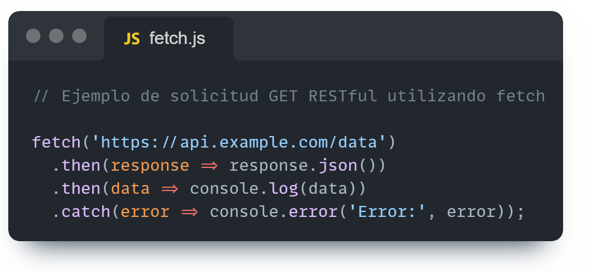

- [REST](#rest) 

- [Javascript - AJAX](#javascript-ajax) 

- [Cómo hacer una solicitud con AJAX ](#ccomo-hacer-una-solicitud-con-AJAX) 

- [Cómo hacer una solicitud con "fetch" ](#como-hacer-una-solicitud-con-fetch) 

##REST  

REST (Representational State Transfer) es un estilo arquitectónico para definir servicios web que sean simples, escalables y eficientes. En el contexto de la web, REST utiliza URIs (Identificadores de Recursos Uniformes) para identificar recursos y el protocolo HTTP para realizar llamadas sobre esos recursos(GET, POST, PUT y DELETE,principalmente). Esto permite una comunicación cliente-servidor donde el cliente puede solicitar y manipular datos al servidor de manera uniforme. 

Resumiendo, REST sería la tecnología con la que vamos a dessarrollar las APIs que estén preparadas para recibir las solicitudes que necesitemos.

## Javascript - AJAX 

JavaScript y AJAX (JavaScript asíncrono y XML) están estrechamente relacionados con REST en el desarrollo de aplicaciones web. JavaScript es un lenguaje de programación que se ejecuta en el navegador del cliente, lo que le permite interactuar con los recursos en un servidor a través de solicitudes HTTP.

AJAX no es un lenguaje de programación, es una técnica que utiliza JavaScript para realizar solicitudes HTTP asíncronas desde el navegador hacia el servidor sin necesidad de recargar la página completa. Esto permite que las aplicaciones web actualicen dinámicamente el contenido sin interrumpir la experiencia del usuario, ya que cuando hacemos una solicitud esperamos una respuesta, y esta respuesta puede tardar en llegar. Si no hacemos que nuestro código sea asíncrono, bloquearíamos durante todo ese rato nuestra página, ya que no permitiríamos más de un hilo de ejecución y no podría continuar leyendo nuestro código hasta recibir la respuesta que espera.

Normalmente se utiliza AJAX también acompañado de frameworks como Vue y React para aprovechar el dinamismo que le da la asincronía a la página, y permitiéndonos por ejemplo con estos dos frameworks que usan componentes, hacer que cada componente de la página cargue independientemente del otro.

## Cómo hacer una solicitud con AJAX 
A continuación, muestro un ejemplo básico de uso de AJAX en Javascript.
El siguiente código realiza una solicitud GET asíncrona a la ruta "https://api.example.com/data", espera a que la solicitud se complete, analiza la respuesta JSON del servidor y la muestra en la consola del navegador:

**var request = new XMLHttpRequest();**
Esto crea una nueva instancia de XMLHttpRequest, que es el objeto principal utilizado para hacer solicitudes HTTP desde el navegador.

**request.open("GET", "https://api.example.com/data", true);**
Aquí se configura la solicitud. El primer parámetro es el método HTTP que se utilizará, en este caso el método "GET". El segundo parámetro es la URL a la que se enviará la solicitud. El tercer parámetro indica si la solicitud es asíncrona o no. Si es true, la solicitud es asíncrona; si es false, la solicitud es síncrona. En la mayoría de los casos, se prefiere que las solicitudes sean asíncronas para evitar bloquear la interfaz de usuario mientras se espera la respuesta del servidor.

**request.onreadystatechange = function() { ... }**
Esta línea establece una función que se llamará cada vez que cambie el estado de la solicitud. El objeto XMLHttpRequest pasa por varios estados durante el ciclo de vida de la solicitud, y esta función se ejecutará cuando cambie el estado.

**if (request.readyState === 4 && request.status === 200) { ... }**
En esta línea, se verifica si la solicitud se ha completado correctamente (estado 4) y si el código de estado HTTP es 200, lo que significa que la solicitud ha sido exitosa.

**var response = JSON.parse(request.responseText);**
Aquí, se analiza la respuesta del servidor, que normalmente es un texto plano. La función JSON.parse() convierte este texto en un objeto JavaScript.

**console.log(response);**
Se imprime la respuesta en la consola del navegador.

## Cómo hacer una solicitud con "fetch" 

Este es un ejemplo de código JavaScript que utiliza la función fetch para realizar una solicitud GET RESTful. 

**fetch('https://api.example.com/data')**

*fetch()* es una función que se utiliza para realizar solicitudes HTTP. Coge un argumento, que es la URL a la que se realizará la solicitud. En este caso, se está realizando una solicitud GET a la URL *'https://api.example.com/data'*.

  **.then(response => response.json())**
  
*.then()* se utiliza para encadenar una acción que se realizará después de que se complete la solicitud. En este caso, se proporciona una función flecha que toma la respuesta de la solicitud como argumento. Dentro de esta función, se llama al método *json()* en la respuesta para parsear la respuesta como JSON. Esto devuelve una promesa que se resuelve con los datos JSON de la respuesta.

  **.then(data => console.log(data))**
  
Se encadena otro *.then()*, que toma los datos parseados como JSON como argumento y simplemente los imprime en la consola del navegador utilizando *console.log()*.

  **.catch(error => console.error('Error:', error));**
  
*.catch()* se utiliza para manejar cualquier error que ocurra durante la solicitud o el procesamiento de la respuesta. Si ocurre un error, se ejecutará la función de flecha proporcionada, que toma el error como argumento y lo imprime en la consola utilizando
**console.error().**

Entonces, en resumen, este código realiza una solicitud GET a la URL proporcionada, parsea la respuesta como JSON y la imprime en la consola del navegador. Además, maneja cualquier error que pueda ocurrir durante el proceso de solicitud o procesamiento de la respuesta.
